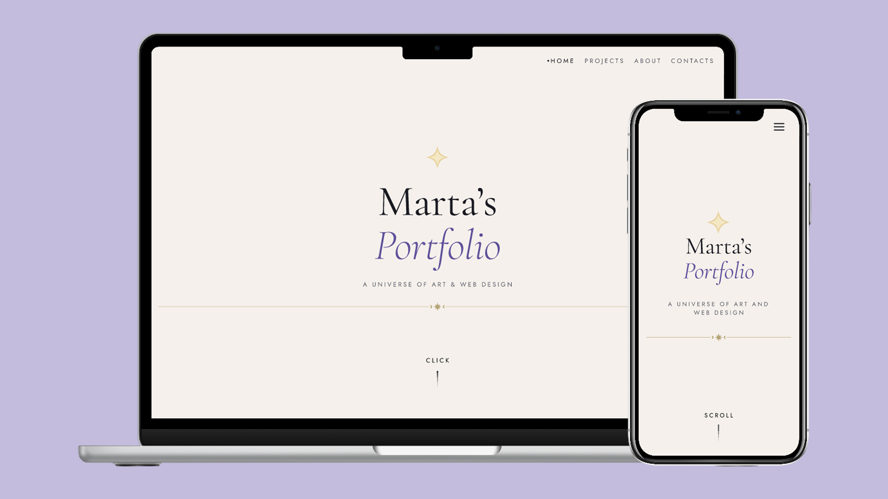

# Marta Cruz · Portfolio

My personal portfolio: a space-themed site where each project is its own planet, told as a scroll story from the hero down to contact.

**Live site:** [martacruz-design.vercel.app](https://martacruz-design.vercel.app)

## The idea

I wanted my portfolio to feel like a journey rather than a list of projects. Scrolling takes you through a short story, from the opening scene down through the projects sections, about me and ending at contact.

## Design

I designed the site in Figma before coding it, starting with a small design system:

- **Colours:** a near-black background (`#0B0B1F`), a warm off-white (`#FAFAF7`) and soft gold accents (`#FFD580`, `#FFE5B4`)
- **Typography:** Cormorant Garamond for headings and Jost for body text
- **Responsive variables** for desktop and mobile, and reusable components like the navigation
- **Hand-drawn illustrations** in about me section

## Features

- **Scroll-driven hero** animated with GSAP
- **Planet-style project cards** that link to each case study
- **About and skills sections** that are part of the same scroll story
- **Responsive layout** built with CSS Grid and Bootstrap

## Built with

HTML, CSS, JavaScript, Bootstrap 5, GSAP

## Run it locally

Clone the repo and open `index.html` in your browser.

## What I'd do next

Do usability tests with real users, translate the website to portuguese, add my CV in the about me section.

---

Made by Marta Moreira da Cruz · [LinkedIn](https://linkedin.com/in/marta-moreira-da-cruz-309512254) 
